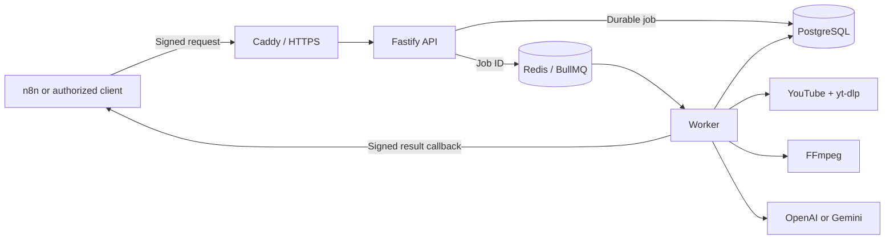

# ETM Class Engine

Production-oriented, self-hosted engine that turns authorized English-class recordings into
structured pedagogical analysis. It downloads an approved YouTube video, reconstructs a
timestamped transcript, optionally inspects selected frames, generates schema-validated JSON with
OpenAI or Gemini, stores the result durably, and delivers it to n8n through a signed webhook.

> Portfolio project. Credentials, customer data, recordings, production URLs, and generated
> analyses are intentionally excluded from this repository.

## What this project demonstrates

- A secure HMAC-authenticated API with CIDR allowlisting, replay protection, rate limiting, and
  idempotent requests.
- A durable asynchronous pipeline built with BullMQ, Redis, PostgreSQL, and Prisma.
- Provider routing between OpenAI and Gemini for transcription, synthesis, and optional visual
  analysis.
- Media processing with `yt-dlp` and FFmpeg, bounded frame extraction, transcript overlap
  deduplication, and deterministic cleanup.
- Strict Zod/JSON Schema validation before results are stored or delivered.
- Signed, retried, idempotent webhook delivery to n8n without rerunning paid AI work when the
  callback is unavailable.
- A least-privilege Docker topology with Caddy as the only public service.

## System design



The request returns immediately with `202 Accepted`. Processing continues asynchronously while
PostgreSQL remains the source of truth for job state and final output.

```text
request
  → validate source, HMAC, timestamp, body, and idempotency
  → inspect authorized YouTube metadata
  → download and normalize audio
  → transcribe chronological chunks
  → optionally extract and analyze bounded visual evidence
  → synthesize and validate the final JSON
  → store the complete result
  → deliver a signed callback to n8n
```

See the detailed [architecture](docs/architecture.md), [API contract](docs/api.md),
[security model](docs/security.md), and [n8n integration](docs/n8n-integration.md).

## Example input

```http
POST /v1/classes/DEMOclass01/analyze
X-ETM-Timestamp: 1784764800
X-ETM-Signature: sha256=<hmac>
Idempotency-Key: portfolio-demo-001
Content-Type: application/json

{
  "teacher": "Alex Morgan",
  "classDate": "2026-07-16",
  "course": "English Workshop",
  "analyzeVisuals": true
}
```

The complete output follows a stable schema containing metadata, summary, objectives, sections,
concepts, vocabulary, grammar, pronunciation, teacher corrections, difficulties, visual evidence,
exercises, next steps, and the full timestamped transcript.

An anonymized response is available at
[`examples/sample-analysis.json`](examples/sample-analysis.json).

## Reliability and cost controls

- Active jobs are unique per video, and request idempotency is enforced transactionally.
- Worker attempts use exponential backoff and stalled-job recovery.
- Temporary audio and frames are deleted in a `finally` block after success or failure.
- Visual analysis is enabled only when both the server and the request opt in.
- Frame count, dimensions, AI batches, media duration, disk use, and JSON size are bounded.
- A callback outage records a completed analysis with a failed delivery state; it never repeats
  transcription or analysis merely to retry the webhook.
- Oversized results are preserved in full with an explicit warning and exact character count.

## Technology

| Area               | Implementation           |
| ------------------ | ------------------------ |
| API and validation | TypeScript, Fastify, Zod |
| Queue and recovery | BullMQ, Redis            |
| Durable storage    | PostgreSQL, Prisma       |
| Media pipeline     | yt-dlp, FFmpeg           |
| AI providers       | OpenAI, Gemini           |
| Edge and TLS       | Caddy                    |
| Deployment         | Docker Compose           |
| Automation output  | Signed n8n webhook       |
| Quality            | Vitest, ESLint, Prettier |

## Local verification

Requirements:

- Node.js 22 or newer
- Docker Desktop or Docker Engine with Compose
- AI credentials only for an intentional end-to-end run

Unit and integration tests mock YouTube, AI providers, FFmpeg, PostgreSQL, Redis, and n8n. Running
the test suite does not consume paid AI credits.

```bash
npm ci
npm run build
npm test
npm run lint
npm run format:check
```

For the complete local stack:

```bash
cp .env.example .env
mkdir -p secrets
install -m 600 /dev/null secrets/youtube_cookies
# Set local secrets and an authorized test channel in .env.
docker compose config
docker compose up -d --build
docker compose ps
curl http://localhost:8080/health
curl http://localhost:8080/ready
```

Only Caddy publishes host ports. PostgreSQL and Redis stay on internal Docker networks.

## AI provider configuration

Use one provider for every stage:

```dotenv
AI_PROVIDER=gemini
GEMINI_API_KEY=replace-with-a-real-key
```

Or route stages independently:

```dotenv
AI_PROVIDER=gemini
TRANSCRIPTION_PROVIDER=openai
ANALYSIS_PROVIDER=gemini
VISUAL_PROVIDER=gemini
OPENAI_API_KEY=replace-with-a-real-key
GEMINI_API_KEY=replace-with-a-real-key
```

Empty stage overrides inherit `AI_PROVIDER`. Startup validation rejects missing keys and
incompatible combinations. OpenAI transcription uses `whisper-1` because this pipeline requires
`verbose_json` segment timestamps.

## Security boundaries

- `.env`, cookie files, generated outputs, dumps, logs, and temporary media are Git-ignored and
  excluded from the Docker build context.
- API and callback secrets are never included in queue payloads or application logs.
- YouTube content must match an explicit channel allowlist.
- The worker invokes media tools without a shell and processes files in a restricted job
  directory.
- Containers run without unnecessary public ports; the worker drops to an unprivileged user.

Please report security issues privately according to [SECURITY.md](SECURITY.md).

## Repository scope

This public repository is a portfolio and engineering reference. It does not contain a hosted
demo because processing third-party recordings requires authorization and paid provider
credentials. The production environment, automation workflow, real webhook URL, and operational
data are private.

## License

Copyright © 2026 `rierale0`. All rights reserved. The source is visible for portfolio evaluation;
reuse or redistribution requires prior permission. See [LICENSE](LICENSE).
