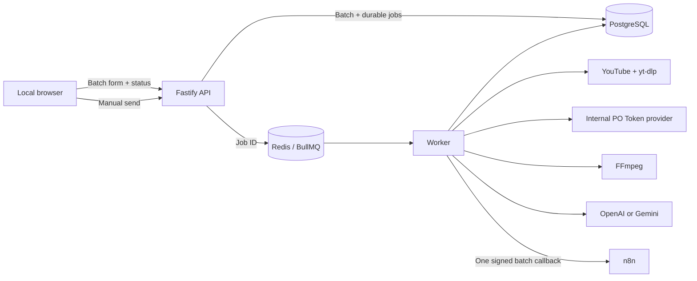

# ETM Class Engine

Local-first, self-hosted engine that turns authorized English-class recordings into
structured pedagogical analysis. It downloads an approved YouTube video, reconstructs a
timestamped transcript, optionally inspects selected frames, generates schema-validated JSON with
OpenAI or Gemini, stores the result durably, and delivers it to n8n through a signed webhook.

> Portfolio project. Credentials, customer data, recordings, production URLs, and generated
> analyses are intentionally excluded from this repository.

## What this project demonstrates

- A browser-based local submission and monitoring interface that never exposes AI secrets.
- A secure HMAC-authenticated API for optional service-to-service automation.
- A durable asynchronous pipeline built with BullMQ, Redis, PostgreSQL, and Prisma.
- Provider routing between OpenAI and Gemini for transcription, synthesis, and optional visual
  analysis.
- Media processing with `yt-dlp`, an automatic PO Token provider, and FFmpeg, plus bounded frame
  extraction, transcript overlap deduplication, and deterministic cleanup.
- Strict Zod/JSON Schema validation before results are stored or delivered.
- Signed, retried, idempotent webhook delivery to n8n without rerunning paid AI work when the
  callback is unavailable.
- A local Docker Desktop topology bound only to loopback, with an optional Caddy edge deployment.

## System design



The request returns immediately with `202 Accepted`. Processing continues asynchronously while
PostgreSQL remains the source of truth for job state and final output.

```text
request
  → validate local origin/URL or service HMAC, body, and idempotency
  → inspect authorized YouTube metadata
  → download and normalize audio
  → transcribe chronological chunks
  → optionally extract and analyze bounded visual evidence
  → synthesize and validate the final JSON
  → store each complete result without an individual callback
  → assemble one deterministic batch JSON
  → deliver it to n8n when the operator clicks Send
```

See the detailed [architecture](docs/architecture.md), [API contract](docs/api.md),
[security model](docs/security.md), and [n8n integration](docs/n8n-integration.md).

## Local application

The default operating mode is a private application on the same computer that runs Docker
Desktop. Every form submission creates a batch containing one, two, or more YouTube links. Each
class keeps its own metadata and visual-analysis choice, while the dashboard tracks individual and
aggregate progress. Once every class completes, the application exposes one combined JSON and a
manual **Send to n8n** action. A failed delivery can be retried without repeating paid AI work.

### Windows quick start

1. Copy `.env.example` to `.env` and set the AI key, database/API secrets, callback secret, and
   `N8N_CALLBACK_URL`.
2. Start Docker Desktop.
3. Run:

```powershell
.\scripts\start-local.ps1
```

The script creates the optional empty cookie secret, builds the stack, waits for readiness, and
opens [http://localhost:8080](http://localhost:8080). The port is bound to `127.0.0.1`; it is not
available to the LAN or Internet.

Before spending AI credits, verify YouTube access through the local connection:

```powershell
.\scripts\test-youtube-local.ps1 `
  -VideoUrl "https://www.youtube.com/watch?v=U_t4DLT7eVQ"
```

Stop the application without deleting PostgreSQL, Redis, or result volumes:

```powershell
.\scripts\stop-local.ps1
```

## Service API example

```http
POST /v1/classes/DEMOclass01/analyze
X-ETM-Timestamp: 1784764800
X-ETM-Signature: sha256=<hmac>
Idempotency-Key: portfolio-demo-001
Content-Type: application/json

{
  "title": "ETM English Class",
  "teacher": "Alex Morgan",
  "classDate": "2026-07-16",
  "course": "English Workshop",
  "analyzeVisuals": true
}
```

The complete output follows a stable schema containing metadata, summary, objectives, sections,
concepts, vocabulary, grammar, pronunciation, teacher corrections, difficulties, visual evidence,
exercises, next steps, and the full timestamped transcript.

An anonymized response is available at
[`examples/sample-analysis.json`](examples/sample-analysis.json).

## Reliability and cost controls

- Active jobs are unique per video, and request idempotency is enforced transactionally.
- Worker attempts use exponential backoff and stalled-job recovery.
- Temporary audio and frames are deleted in a `finally` block after success or failure.
- Visual analysis is enabled only when both the server and the request opt in.
- Frame count, dimensions, AI batches, media duration, disk use, per-class JSON size, batch count,
  and combined JSON bytes are bounded.
- A callback outage records a completed analysis with a failed delivery state; it never repeats
  transcription or analysis merely to retry the webhook.
- Oversized results are preserved in full with an explicit warning and exact character count.

## Technology

| Area               | Implementation           |
| ------------------ | ------------------------ |
| API and validation | TypeScript, Fastify, Zod |
| Queue and recovery | BullMQ, Redis            |
| Durable storage    | PostgreSQL, Prisma       |
| Media pipeline     | yt-dlp, FFmpeg           |
| AI providers       | OpenAI, Gemini           |
| Local interface    | Native HTML/CSS/JS       |
| Optional edge/TLS  | Caddy                    |
| Deployment         | Docker Compose           |
| Automation output  | Signed n8n webhook       |
| Quality            | Vitest, ESLint, Prettier |

## Local verification

Requirements:

- Node.js 22 or newer
- Docker Desktop or Docker Engine with Compose
- AI credentials only for an intentional end-to-end run

Unit and integration tests mock YouTube, AI providers, FFmpeg, PostgreSQL, Redis, and n8n. Running
the test suite does not consume paid AI credits.

```bash
npm ci
npm run build
npm test
npm run lint
npm run format:check
```

For the complete local stack without the PowerShell helper:

```powershell
docker compose -f docker-compose.yml -f docker-compose.local.yml config
docker compose -f docker-compose.yml -f docker-compose.local.yml up -d --build
docker compose -f docker-compose.yml -f docker-compose.local.yml ps
curl http://localhost:8080/health
curl http://localhost:8080/ready
```

Only the Fastify application is published, exclusively on host loopback. PostgreSQL and Redis stay
on internal Docker networks. Caddy is disabled in this mode.

## YouTube PO Tokens

The Compose stack includes a private `bgutil` sidecar and installs its matching yt-dlp plugin in
the worker. PO Tokens are optional in local mode because a normal home/office IP often does not
need them. Set the internal provider URL only when useful:

```dotenv
YOUTUBE_PO_TOKEN_PROVIDER_URL=http://pot-provider:4416
```

An empty value disables PO Token arguments. The Netscape cookie secret remains an optional
fallback for content that genuinely requires an account, such as age-restricted or private media;
ordinary authorized Unlisted videos do not require stored Google credentials.

## AI provider configuration

Use one provider for every stage:

```dotenv
AI_PROVIDER=gemini
GEMINI_API_KEY=replace-with-a-real-key
```

Or route stages independently:

```dotenv
AI_PROVIDER=gemini
TRANSCRIPTION_PROVIDER=openai
ANALYSIS_PROVIDER=gemini
VISUAL_PROVIDER=gemini
OPENAI_API_KEY=replace-with-a-real-key
GEMINI_API_KEY=replace-with-a-real-key
```

Empty stage overrides inherit `AI_PROVIDER`. Startup validation rejects missing keys and
incompatible combinations. OpenAI transcription uses `whisper-1` because this pipeline requires
`verbose_json` segment timestamps.

## Security boundaries

- `.env`, cookie files, generated outputs, dumps, logs, and temporary media are Git-ignored and
  excluded from the Docker build context.
- API and callback secrets are never included in queue payloads or application logs.
- YouTube content must match an explicit channel allowlist.
- The worker invokes media tools without a shell and processes files in a restricted job
  directory.
- Containers run without unnecessary public ports; the worker drops to an unprivileged user, and
  the PO Token sidecar is read-only, capability-free, and reachable only through Docker.

Please report security issues privately according to [SECURITY.md](SECURITY.md).

## Repository scope

This public repository is a portfolio and engineering reference. It does not contain a hosted
demo because processing third-party recordings requires authorization and paid provider
credentials. The production environment, automation workflow, real webhook URL, and operational
data are private.

## License

Copyright © 2026 `rierale0`. All rights reserved. The source is visible for portfolio evaluation;
reuse or redistribution requires prior permission. See [LICENSE](LICENSE).
