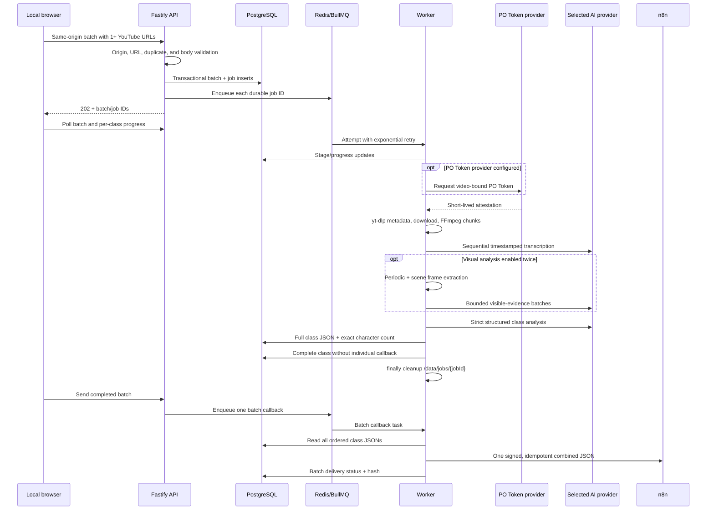

# Architecture

## Local request and processing flow

The worker routes transcription, visual analysis, and synthesis independently to OpenAI or Gemini.
`AI_PROVIDER` supplies the default and the three stage-specific provider variables can override it.
Both adapters return the same internal types, and final output is always checked against the same
strict schema before it reaches PostgreSQL or n8n.

In local mode, Docker publishes the API only at `127.0.0.1:8080`; Caddy is disabled. The API and
databases use the internal `172.29.0.0/24` Docker network. In optional edge mode, Caddy uses the
reserved address `172.29.0.10` on that network and has an edge network
for ACME and HTTPS. The worker has a separate egress network for YouTube, the configured AI
providers, n8n, and the private PO Token sidecar. The sidecar has no host port and the matching
yt-dlp plugin is checksum-pinned in the worker image. In edge mode, no service other than Caddy
publishes a host port. The HMAC API remains available for service-to-service automation, but the
local browser never receives or handles its secret.

## Durability and retries

PostgreSQL is authoritative for job state and results. BullMQ stores work delivery in append-only
Redis and retries four times with exponential backoff. BullMQ stalled-job recovery handles worker
loss; a periodic database sweep re-enqueues old active rows missing from Redis. Processing checks
for cancellation at safe boundaries (the current public status set has no cancellation endpoint).
Non-final retryable attempts return the durable row to `queued`; terminal attempts store a
sanitized failure and deliver a failure callback.

A browser submission is always a batch, even with one video. Batch jobs never send individual
callbacks. After every class is complete, a deterministic assembler preserves each class JSON
under its video ID and adds explicit input order. The operator initiates the single batch callback
from the dashboard. Callback redelivery reads the stored terminal results and never invokes
YouTube, FFmpeg, transcription, visual analysis, or synthesis again.

The partial unique PostgreSQL index `Job_one_active_video_key` prevents concurrent active jobs for
one video, including races. A completed or failed video may be intentionally submitted again with
a new key; there is no administrative override endpoint.

## Data boundaries

PostgreSQL stores batch metadata, ordered job relations, request metadata, job/error state,
delivery state, warnings, and final class analyses. It never stores API secrets, YouTube cookies,
or raw temporary media. Redis contains queue payloads with only a durable job or batch UUID.
`/data/jobs/{uuid}` is mode-restricted worker scratch space and is
removed in a `finally` block. The worker entrypoint initializes the mounted volume as root and
immediately drops privileges with `gosu`; the Node process itself runs as `node`.
